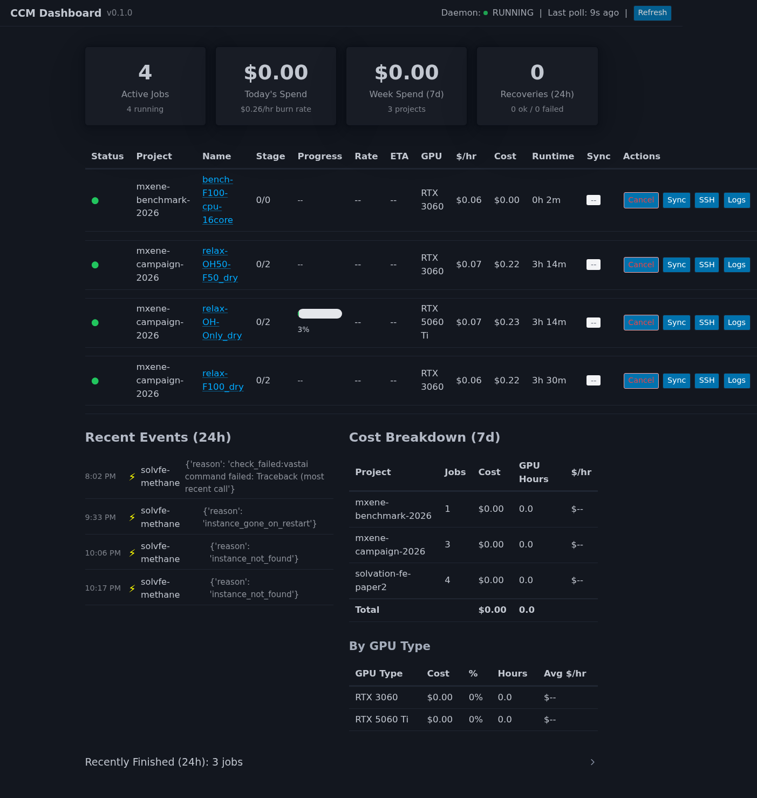

<p align="center">
  <h1 align="center">CloudComputeManager</h1>
  <p align="center">
    <strong>GPU cloud management for scientific computing on Vast.ai spot instances</strong>
  </p>
  <p align="center">
    <a href="docs/usage.md"></a>
    
    
    
    
  </p>
</p>

---

CCM handles the full lifecycle of GPU workloads on spot instances: provisioning, environment setup, job execution, progress monitoring, checkpoint/sync, preemption recovery, cost tracking, and multi-stage pipelines. **Workload-agnostic** — works for LAMMPS, PyTorch, OpenMM, GROMACS, or anything with a CLI.

<p align="center">
  
  <br>
  <em>Live dashboard with 4 active jobs across 3 projects, real-time progress tracking, cost breakdown by GPU type</em>
</p>

## Highlights

| Feature | Description |
|---------|-------------|
| **One-command deployment** | `ccm jobs submit job.yaml` — finds cheapest GPU, provisions, installs software, runs job |
| **Preemption recovery** | SIGTERM trap → checkpoint → new instance → restore → resume. Automatic. |
| **Multi-stage pipelines** | Chain stages: equilibration → production → analysis. Daemon auto-advances. |
| **Live dashboard** | `ccm dashboard` — real-time view of all jobs, costs, events with SSE updates |
| **Batch sweeps** | Matrix YAML expands to N jobs via Cartesian product. One command for 22 runs. |
| **Agent-native** | Python SDK + CLI designed for AI agents. SSH credentials exposed directly. |
| **Environment management** | conda-pack, conda env, pip, apt, Docker — auto-selects fastest strategy |
| **Budget enforcement** | Per-job cost/time limits. Auto-terminates when exceeded. |
| **Instance integrity** | Every instance labeled on Vast.ai. Unmanaged instances flagged on dashboard. |

## Quick Start

```bash
# Install
pip install -e ".[dev]"
ccm config init
echo "your-api-key" > ~/.vast_api_key

# Submit a job
ccm jobs submit job.yaml

# Open the dashboard
ccm dashboard

# Check on jobs after being away
ccm reconnect
```

## Job Configuration

```yaml
name: my-simulation
project: my-project
image: ubuntu:22.04

setup: |
  apt-get update && apt-get install -y lammps

command: mpirun -np 16 lmp -in simulation.inp

resources:
  gpu_type: RTX_3060
  cpu_cores: 16
  disk_gb: 50

budget:
  max_cost_usd: 5.00
  max_hourly_rate: 0.10

# Multi-stage pipeline
stages:
  - name: equilibration
    command: mpirun -np 16 lmp -in equil.inp
  - name: production
    command: mpirun -np 16 lmp -in prod.inp

# Live progress tracking
progress:
  type: regex_parse
  file: /workspace/output.log
  regex: 'Step\s+(\d+)'
  total: 5000000

# Notifications
notifications:
  on_complete: "echo 'Done: ${JOB_NAME}' >> ~/alerts.log"
  on_failure: "curl -X POST https://hooks.slack.com/..."

# Variable substitution
upload:
  source: ./input_files/
sync:
  enabled: true
  source: /workspace/results
```

```bash
ccm jobs submit job.yaml --set STRUCTURE=F100 --set DATA_FILE=input.data
```

## CLI Reference

```bash
# Job lifecycle
ccm jobs submit job.yaml [--set KEY=VALUE] [--template lammps-gpu] [--wait]
ccm jobs list [--project my-project] [--status running]
ccm jobs status <job_id>
ccm jobs logs <job_id> [--follow]
ccm jobs cancel <job_id>
ccm jobs reconnect                     # Rehydrate state after downtime

# Instance interaction
ccm exec <job_id> "tail -20 output.log"
ccm ssh <job_id>
ccm upload <job_id> ./file /workspace/

# Batch operations
ccm batch submit sweep.yaml --parallel 5
ccm batch status --project my-project
ccm batch wait --project my-project

# GPU search & benchmarks
ccm search RTX_4090 --max-price 0.50
ccm benchmark run benchmark.yaml
ccm benchmark results

# Infrastructure
ccm dashboard                          # Web UI
ccm daemon start                       # Background monitor
ccm cleanup [--execute]                # Clean stale jobs
```

## Batch Sweeps

Define a parameter matrix — CCM expands it into N jobs automatically:

```yaml
# sweep.yaml
template: job-template.yaml
matrix:
  STRESS: [50, 100, 150, 200, 250, 300]
  DIRECTION: [X, Y]
# → 12 jobs (6 × 2)
```

```bash
ccm batch submit sweep.yaml            # Creates 12 jobs
ccm batch submit sweep.yaml --dry-run  # Preview first
```

## Python SDK

```python
from cloudcomputemanager.agents import CloudComputeManagerAgent, JobSpec

async with CloudComputeManagerAgent() as vm:
    job = await vm.submit(JobSpec(
        name="simulation",
        command="mpirun lmp -in input.in",
        gpu_type="RTX_3060",
        max_hourly_rate=0.10,
    ))

    # Direct SSH access
    creds = await vm.get_ssh_credentials(job.job_id)

    # Wait for results
    result = await vm.wait_for_completion(job.job_id)
    print(f"Cost: ${result.total_cost_usd:.2f}")
```

## Resilience

| Scenario | What Happens |
|----------|-------------|
| Laptop sleeps | Job continues (nohup). `ccm reconnect` when back. |
| Instance preempted | SIGTERM trap → checkpoint → auto-recover on new instance |
| Daemon was down | On restart, reconciles all missed completions and failures |
| Budget exceeded | Auto-terminates, syncs results first, fires notification |

## Architecture

```
src/cloudcomputemanager/
├── agents/sdk.py          Async Python SDK
├── api/                   FastAPI REST API
├── benchmarks/            GPU cost-performance framework
├── checkpoint/            LAMMPS, PyTorch, generic checkpoint detection
├── cli/                   45+ Typer commands
├── core/
│   ├── models.py          Job, Instance, Checkpoint, CostRecord
│   ├── wrapper.py         SIGTERM-aware execution wrapper
│   ├── instances.py       Vast.ai label sync + instance tracking
│   ├── templates.py       YAML loading, merging, ${VAR} substitution
│   └── environment.py     conda-pack, conda env, pip, apt strategies
├── dashboard/             Web UI (FastAPI + HTMX + SSE)
├── daemon/                Background monitoring + recovery
├── providers/vast.py      Vast.ai integration (SSH retry, rsync, labels)
└── sync/                  Rsync-based data synchronization
```

## Templates

```bash
ccm templates list
ccm templates show lammps-gpu
```

| Template | GPU | Checkpoint | Use Case |
|----------|-----|------------|----------|
| `quick-gpu` | RTX_3060 | — | Quick experiments |
| `lammps-gpu` | RTX_3060 | restart.* | MD simulations |
| `namd-production` | RTX_3060 | *.restart.* | NAMD production |
| `pytorch-train` | RTX_4090 | *.pt | ML training |
| `jupyter-dev` | RTX_3060 | — | Interactive dev |
| `llm-inference` | RTX_4090 | — | LLM serving |

## Documentation

| Document | Contents |
|----------|----------|
| **[docs/usage.md](docs/usage.md)** | Complete reference — YAML schema, CLI, SDK, resilience, multi-agent |
| **[docs/ENVIRONMENT_DESIGN.md](docs/ENVIRONMENT_DESIGN.md)** | Environment management strategies |
| **[docs/DASHBOARD_PLAN.md](docs/DASHBOARD_PLAN.md)** | Dashboard architecture and design |
| **[docs/INSTANCE_INTEGRITY_PLAN.md](docs/INSTANCE_INTEGRITY_PLAN.md)** | Instance labeling and tracking |
| **[AGENTS.md](AGENTS.md)** | Current development status |

## Development

```bash
pip install -e ".[dev]"

# Run tests (368+ passing)
pytest tests/ --ignore=tests/test_e2e_full_lifecycle.py \
              --ignore=tests/test_integration_vast.py

# Integration tests (requires API key, costs money)
pytest tests/test_integration_vast.py --run-integration
```

## License

MIT
